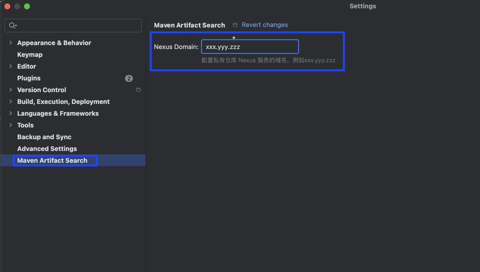
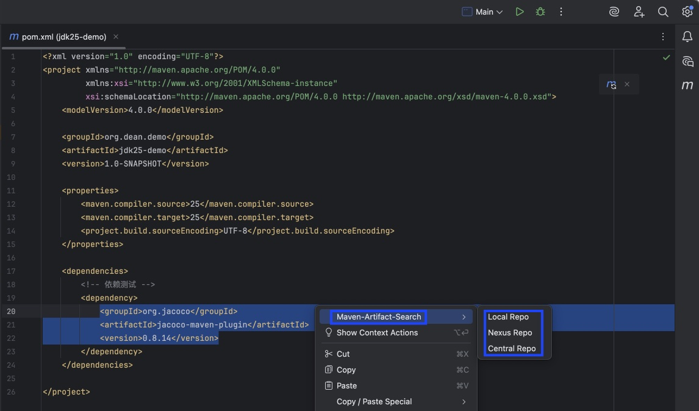

# 等审核下来了再补充正式插件市场链接地址
https://plugins.jetbrains.com/plugin/29300-maven-artifact-search/edit/versions/stable/908843

2025-12-08 提交的，预计两个工作日审核，2025-12-11这天再看看吧


# Maven Artifact Search

一个 IntelliJ IDEA 插件，用于快速搜索和定位 Maven 构件。支持在本地仓库、Nexus 仓库和 Central 仓库中查找 Maven 构件。

## 功能特性

- 🔍 **智能解析**：自动从编辑器中选中的 XML 内容解析 `groupId`、`artifactId`、`version`
- 📁 **本地仓库**：快速打开本地 Maven 仓库中的构件目录（macOS Finder）
- 🌐 **Nexus 仓库搜索**：在 Nexus 仓库中搜索指定的 Maven 构件（支持自定义域名配置）
- 📦 **Maven Central 搜索**：在 Maven Repository 中搜索构件信息
- ⚙️ **配置界面**：在 Settings 中配置 Nexus 仓库域名
- ⚡  **右键菜单集成**：在编辑器右键菜单的第一个位置提供快速访问，还可以手动添加到Floating Code Toolbar中
- 🔄 **动态插件**：支持热重载，无需重启 IDE

## 系统要求

- IntelliJ IDEA 2025.1 或更高版本（sinceBuild: 251）
- Java 21
- macOS

## 安装方法

### 从源码构建安装

1. 克隆或下载本项目
2. 使用 Gradle 构建插件：
   ```bash
   ./gradlew buildPlugin
   ```
3. 在 IntelliJ IDEA 中：
   - 打开 `File` → `Settings` → `Plugins`
   - 点击 `⚙️` → `Install Plugin from Disk...`
   - 选择 `build/libs/maven-artifact-search-1.0-SNAPSHOT.jar`
   - 重启 IDE

### 开发模式运行

```bash
./gradlew runIde
```

这将启动一个带有插件的 IntelliJ IDEA 实例，用于测试和开发。

### 热重载（开发时）

插件支持动态加载，在开发时修改代码后：

1. 重新构建插件：
   ```bash
   ./gradlew buildPlugin
   ```

2. 在运行中的 IDE 实例中：
   - 使用 `File` → `Reload Changed Classes` 重新加载更改
   - 或使用 `File` → `Invalidate Caches / Restart` → `Reload Changed Classes`

代码更改会立即生效，无需重启 IDE。

## 使用方法

### 配置 Nexus 域名（首次使用）

在使用 Nexus Repo 功能之前，需要先配置 Nexus 仓库域名：

1. 打开 `File` → `Settings` → `Other Settings` → `Maven Artifact Search`
2. 在 "Nexus Domain" 输入框中输入你的 Nexus 仓库域名（例如：`xxx.yyy.zzz`）
3. 点击 "Apply" 或 "OK" 保存配置

> **注意**：如果不配置 Nexus 域名，使用 Nexus Repo 功能时会提示配置错误。


### 基本使用

1. **选中 Maven 依赖 XML 内容**
   
   在编辑器中选中包含 Maven 依赖的 XML 内容，例如：
   ```xml
   <groupId>org.jacoco</groupId>
   <artifactId>jacoco-maven-plugin</artifactId>
   <version>0.8.14</version>
   ```
   或者
    ```xml
   <groupId>org.jacoco</groupId>
   <artifactId>jacoco-maven-plugin</artifactId>
   ```
   或者
    ```xml
   <groupId>org.jacoco</groupId>
   ```
   都可以解析并正常搜索和定位


2. **右键打开菜单**
   
   在编辑器中右键点击，选择 `Maven-Artifact-Search` 菜单

3. **选择功能**
   
   - **Local Repo**：在 macOS Finder 中打开本地 M2 仓库目录
   - **Nexus Repo**：在浏览器中打开 Nexus 仓库搜索页面（使用配置的域名）
   - **Central Repo**：在浏览器中打开 Central Repository 搜索页面



### 功能说明

#### Local Repo

- 根据 Maven 本地仓库路径规范构建路径：`~/.m2/repository/{groupId}/{artifactId}/{version}`
- 将 `groupId` 中的点（`.`）替换为斜杠（`/`）
- 在 macOS Finder 中打开对应的目录
- 如果路径不存在，会显示警告提示

#### Nexus Repo

- 构建 Nexus 仓库搜索 URL
- 格式：`https://{配置的域名}/#browse/search/maven=attributes.maven2.groupId%3D{groupId}%20AND%20attributes.maven2.artifactId%3D{artifactId}%20AND%20attributes.maven2.baseVersion%3D{version}`
- 使用配置的 Nexus 域名（在 Settings 中配置）
- 如果未配置域名，会显示错误提示
- 使用默认浏览器打开搜索页面

#### Central Repo

- 构建 Maven Repository 构件 URL
- 格式：`https://mvnrepository.com/artifact/{groupId}/{artifactId}/{version}`
- 如果提供了版本号，直接打开构件页面；否则打开搜索页面
- 使用默认浏览器打开页面

## 项目结构

```
maven-artifact-search/
├── src/
│   └── main/
│       ├── kotlin/
│       │   └── org/dean/idea/plugin/mavenartifactsearch/
│       │       ├── MavenArtifactParser.kt              # XML 解析器
│       │       ├── MavenArtifactSearchActionGroup.kt   # 主菜单组
│       │       ├── LocalRepoAction.kt                  # 本地仓库功能
│       │       ├── NexusRepoAction.kt                  # Nexus 仓库搜索
│       │       ├── CentralRepoAction.kt                # Central Repository 搜索
│       │       ├── MavenArtifactSearchSettings.kt      # 配置状态管理
│       │       └── MavenArtifactSearchConfigurable.kt  # 设置界面
│       └── resources/
│           └── META-INF/
│               ├── plugin.xml                          # 插件配置
│               └── pluginIcon.svg                     # 插件图标
├── build.gradle.kts                                    # Gradle 构建配置
└── README.md
```

## 开发说明

### 技术栈

- **语言**：Kotlin
- **构建工具**：Gradle
- **IntelliJ Platform SDK**：2.7.1
- **Kotlin 版本**：2.1.0
- **Java 版本**：21

### 构建项目

```bash
# 构建插件 JAR
./gradlew buildPlugin

# 运行测试
./gradlew test

# 清理构建
./gradlew clean
```

### 插件配置

插件的主要配置在 `src/main/resources/META-INF/plugin.xml` 中：

- **插件 ID**：`org.dean.idea.plugin.maven-artifact-search`
- **插件名称**：`Maven-Artifact-Search`
- **菜单位置**：编辑器右键菜单第一个位置（`EditorPopupMenu`，`anchor="first"`）
- **动态插件**：支持热重载，无需重启 IDE（`require-restart="false"`）
- **设置界面**：在 `Other Settings` 中提供配置界面

### 核心功能实现

#### XML 解析

`MavenArtifactParser` 类负责从编辑器中解析 Maven 依赖信息：

- 支持从选中的文本中解析
- 支持从 PSI 树中解析（即使没有选中文本，也能从光标位置解析）
- 自动提取 `groupId` ， `artifactId` ， `version`

#### 路径构建

`LocalRepoAction` 根据 Maven 本地仓库规范构建路径：

- 基础路径：`~/.m2/repository`
- 将 `groupId` 中的点替换为路径分隔符
- 拼接 `artifactId` 路径
- 如果提供了版本号，拼接 `version` 路径

#### 配置管理

`MavenArtifactSearchSettings` 使用 `PersistentStateComponent` 持久化保存配置：

- 配置保存在 `maven-artifact-search.xml` 文件中
- 支持 Nexus 域名配置
- 配置在 IDE 重启后自动加载

#### 设置界面

`MavenArtifactSearchConfigurable` 提供设置界面：

- 在 `Settings` → `Other Settings` → `Maven Artifact Search` 中显示
- 提供 Nexus 域名配置输入框
- 支持保存和重置功能

## 构建和发布

### 构建插件

```bash
./gradlew buildPlugin
```

构建产物位于 `build/libs/` 目录。

### 发布到 JetBrains Marketplace

1. 登录 [JetBrains Plugin Repository](https://plugins.jetbrains.com/)
2. 创建新插件或更新现有插件
3. 上传构建好的 JAR 文件
4. 填写插件描述、截图等信息
5. 提交审核

### 本地安装测试

```bash
# 构建插件
./gradlew buildPlugin

# 在 IDEA 中安装
# File → Settings → Plugins → ⚙️ → Install Plugin from Disk...
# 选择 build/libs/maven-artifact-search-1.0-SNAPSHOT.jar
```

## 常见问题

### Q: 为什么 本地仓库功能在 Windows/Linux 上不工作？

A: Local Repo功能目前仅支持 macOS，使用 `open` 命令在 Finder 中打开文件夹。Windows 和 Linux 版本需要修改为使用对应的系统命令。

### Q: 无法解析 groupId、artifactId、version？

A: 请确保：
- 选中了包含 `<groupId>`、`<artifactId>` 和 `<version>` 标签的 XML 内容
- XML 格式正确，必须需要选中`<groupId>`， `<artifactId>` 和 `<version>`可选
- 标签名称拼写正确
- 即使没有选中文本，插件也会尝试从光标位置的 PSI 树中解析

### Q: Nexus Repo 功能提示需要配置域名？

A: 请按照以下步骤配置：
1. 打开 `File` → `Settings` → `Other Settings` → `Maven Artifact Search`
2. 在 "Nexus Domain" 输入框中输入你的 Nexus 仓库域名
3. 点击 "Apply" 或 "OK" 保存配置

### Q: 路径不存在怎么办？

A: 插件会显示警告提示。请检查：
- Maven 本地仓库路径是否正确（默认 `~/.m2/repository`）
- 该构件是否已经下载到本地
- 路径权限是否正确

## 贡献

欢迎提交 Issue 和 Pull Request！

## 许可证

本项目采用 MIT 许可证。

## 作者

Dean Org

## 更新日志

### 1.0-SNAPSHOT

- ✅ 初始版本
- ✅ 支持本地仓库查找（macOS）
- ✅ 支持 Nexus 仓库搜索（可配置域名）
- ✅ 支持 Maven Central Repository 搜索
- ✅ 智能 XML 解析功能（支持解析 groupId、artifactId、version）
- ✅ 配置界面（Settings → Other Settings → Maven Artifact Search）
- ✅ 动态插件支持（热重载，无需重启 IDE）
- ✅ AI 风格图标设计

